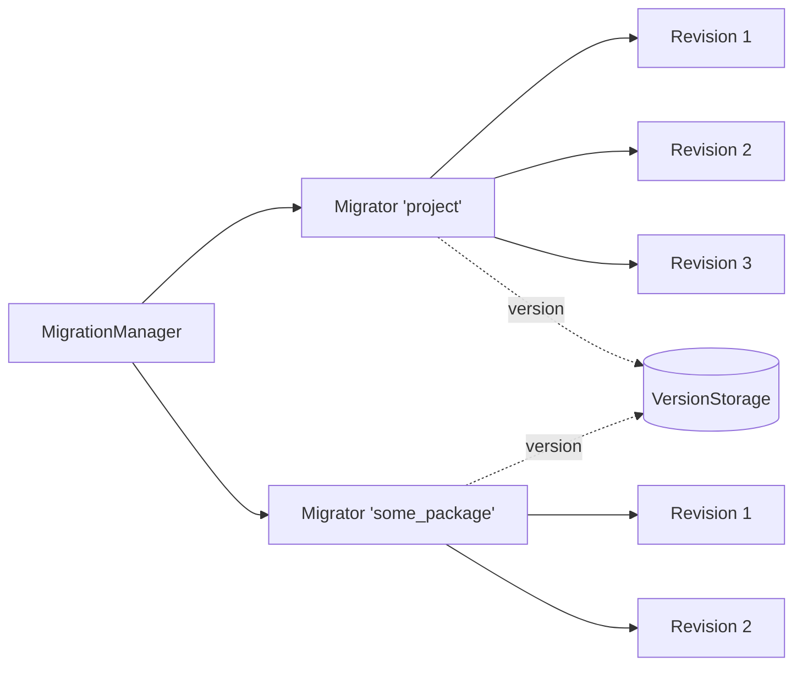

# Migration System

## Table of Contents

1. [Overview](#overview)
2. [Core Concepts](#core-concepts)
3. [Writing Revisions](#writing-revisions)
4. [Setting Up a Migrator](#setting-up-a-migrator)
5. [Console Commands](#console-commands)
6. [Version Storage](#version-storage)
7. [Migration Logging](#migration-logging)
8. [Ordering Across Migrators: MigratorRevision](#ordering-across-migrators-migratorrevision)
9. [File-Based Revisions in Projects](file-based-revisions.md) — the dry-project pattern with timestamped revision files and package pins

## Overview

Oak's migration system is deliberately minimal: there are no timestamped migration files or dependency graphs. Each package, module, or project owns a **Migrator** — an ordered list of **revisions** with a single integer version counter. Migrating means walking that list up (or down) one revision at a time, persisting the counter after every step.

The moving parts live in _src/Migration/_ with their interfaces in _src/Contracts/Migration/_.



## Core Concepts

| Concept           | Class / Interface                                  | Role                                                                          |
| ----------------- | -------------------------------------------------- | ----------------------------------------------------------------------------- |
| Revision          | `Oak\Contracts\Migration\RevisionInterface`        | One reversible change: `up()`, `down()`, and a description for each direction |
| Migrator          | `Oak\Migration\Migrator`                           | Named, ordered list of revisions plus the current version                     |
| Migration manager | `Oak\Migration\MigrationManager`                   | Registry of all migrators; what the console commands iterate                  |
| Version storage   | `Oak\Contracts\Migration\VersionStorageInterface`  | Persists each migrator's current version                                      |
| Migration logger  | `Oak\Contracts\Migration\MigrationLoggerInterface` | Reports each applied or reverted revision                                     |

A migrator's version is simply the index of the last applied revision: a migrator with 5 revisions at version 3 has applied the first three. Adding a revision to the end of the list raises the maximum version by one; the next `migrate` run applies only what's new.

> [!warning] Never reorder or remove applied revisions
> The version counter is positional. Reordering, inserting into the middle, or deleting revisions that have run somewhere will silently desynchronize that environment. Only append.

## Writing Revisions

A revision implements `RevisionInterface`:

```php
use Oak\Contracts\Migration\RevisionInterface;

class CreateAccountsTable implements RevisionInterface
{
    public function up()
    {
        // apply the change
    }

    public function down()
    {
        // revert the change
    }

    public function describeUp(): string
    {
        return 'Create the accounts table';
    }

    public function describeDown(): string
    {
        return 'Drop the accounts table';
    }
}
```

Revisions can be set as instances or as class names. Class names are resolved through the container **lazily**, only when the revision actually needs to run — so revisions can take constructor dependencies:

```php
$migrator->setRevisions([CreateAccountsTable::class, new AddAccountIndexes()]);
```

> [!info] `addRevision()` takes instances only
> `Migrator::addRevision()` is type-hinted to `RevisionInterface`, so class-string revisions can only be passed through `setRevisions()`.

## Setting Up a Migrator

`MigrationServiceProvider` wires the migration services (console runtime only): the `MigrationManager` singleton, the `migration` console command, `JsonVersionStorage` as the default version storage, and `ConsoleMigrationLogger` as the default logger.

A package or project registers its own migrator in a service provider's `boot()`:

```php
use Oak\Contracts\Container\ContainerInterface;
use Oak\Contracts\Migration\MigrationLoggerInterface;
use Oak\Contracts\Migration\VersionStorageInterface;
use Oak\Migration\MigrationManager;
use Oak\Migration\Migrator;

public function boot(ContainerInterface $app)
{
    if (! $app->isRunningInConsole()) {
        return;
    }

    $migrator = new Migrator(
        'my_package',
        $app->get(VersionStorageInterface::class),
        $app->get(MigrationLoggerInterface::class),
        $app
    );

    $migrator->setRevisions([
        CreateAccountsTable::class,
        AddAccountIndexes::class,
    ]);

    $app->get(MigrationManager::class)->addMigrator($migrator);
}
```

The migrator's **name** (`'my_package'` above) is its identity: version storage keys on it and the console `-m` option targets it, so it must be unique and stable.

`addMigrator()` also accepts a container key instead of an instance, and an `$autoRun` flag (see [MigratorRevision](#ordering-across-migrators-migratorrevision)):

```php
$manager->addMigrator(MyPackageMigrator::class);
$manager->addMigrator($moduleMigrator, false); // registered, but only runs when targeted or delegated to
```

## Console Commands

All commands are sub-commands of `migration`. Every command that runs migrations accepts `-m <name>` / `--migrator <name>` to target a single migrator.

| Command                    | Effect                                                             |
| -------------------------- | ------------------------------------------------------------------ |
| `migration list`           | Show every migrator with its current and maximum version           |
| `migration migrate`        | Bring migrators fully up to date (all pending revisions)           |
| `migration update`         | Apply the **next** revision only, per migrator                     |
| `migration downdate`       | Revert the **last applied** revision, per migrator                 |
| `migration reset`          | Revert all revisions (roll every migrator back to version 0)       |
| `migration reset-counters` | Set version counters to 0 **without** running any `down()` methods |

Without `-m`, the run commands iterate migrators in registration order (`downdate` and `reset` in reverse registration order) and skip migrators registered with `$autoRun = false`. With `-m`, any registered migrator can be targeted, including non-auto-run ones.

> [!tip] Rolling to a specific version
> Programmatically, `Migrator::rollTo($version)` walks up or down to an exact version. It clamps out-of-range values and is a no-op when already there — the console commands and `MigratorRevision` are all built on it.

## Version Storage

Two implementations of `VersionStorageInterface` ship with Oak, in _src/Migration/Storage/_:

- **`JsonVersionStorage`** (default) — one JSON file holding every migrator's version, keyed by migrator name. The filename comes from the `migration.version_filename` config value.
- **`FileVersionStorage`** — one plain file holding a single version number. Only suitable when a single migrator uses it, since it ignores the migrator's name.

The version file is state, not code: each environment (local, staging, production) has its own.

## Migration Logging

`MigrationLoggerInterface` receives every applied or reverted revision and logs its `describeUp()` / `describeDown()` text:

- **`ConsoleMigrationLogger`** (default) — writes to console output.
- **`FileMigrationLogger`** — appends to a log file.

## Ordering Across Migrators: MigratorRevision

Migrators are independent by design, which leaves one gap: ordering granularity between them is "whole migrator at a time". A plain `migrate` runs each migrator fully, in registration order — a project cannot natively express _"run project revisions 1–2, then package revisions 1–2, then project revision 3"_.

`Oak\Migration\MigratorRevision` closes that gap. It is a revision that **delegates to another migrator**, pinning it to a version at an exact point in the owning migrator's revision list:

```php
use Oak\Migration\MigratorRevision;

$project->setRevisions([
    CreateBaseTables::class,
    new MigratorRevision($packageMigrator, 2), // package revisions 1–2 run here
    AddColumnsToPackageTable::class, // depends on package being at version 2
    new MigratorRevision($packageMigrator, 3, 2), // package revision 3 runs here
    MoreProjectWork::class,
]);
```

- `up()` calls `rollTo($toVersion)` on the wrapped migrator.
- `down()` calls `rollTo($fromVersion)` (default `0`), so rollbacks unwind the delegated revisions at the same point in reverse.
- Both migrators keep their own version counters; because `rollTo()` is idempotent, re-running is always safe.

### Pinning by name

When the wrapped migrator is registered by **another service provider** (typically a vendor package), its instance doesn't exist yet while the project builds its revision list. Use `MigratorRevision::inManager()`, which resolves the migrator by name through the `MigrationManager` at the moment the revision runs:

```php
MigratorRevision::inManager($manager, 'ecommerce', 14);
```

It throws a `RuntimeException` at run time if no migrator with that name is registered by then. See [File-Based Revisions in Projects](file-based-revisions.md) for the full pattern this enables.

### Pin explicit versions

A delegate revision pins a **specific** version rather than "latest" on purpose: once applied, a revision never reruns, so "latest" would mean fresh installs and existing environments end up with different orderings. When the wrapped migrator gains new revisions, add a new pin (with `fromVersion` set to the previous pin) at the point where the project needs them.

### Avoiding double-running

If the wrapped migrator is also auto-run by the manager, a plain `migrate` may fast-forward it before the owning migrator reaches the interleaving point. Two options:

1. **Register it with `$autoRun = false`** — it stays visible in `migration list` and targetable with `-m`, but only moves when a `MigratorRevision` (or explicit `-m`) drives it. Ordering is then fully controlled by the pins.

    ```php
    $manager->addMigrator($project);
    $manager->addMigrator($packageMigrator, false);
    ```

2. **Register it auto-run, after the owning migrator** — pins enforce ordering at the points that matter, and the trailing full run picks up any newer, unpinned revisions. Use this when the package's future revisions are unlikely to need interleaving.
